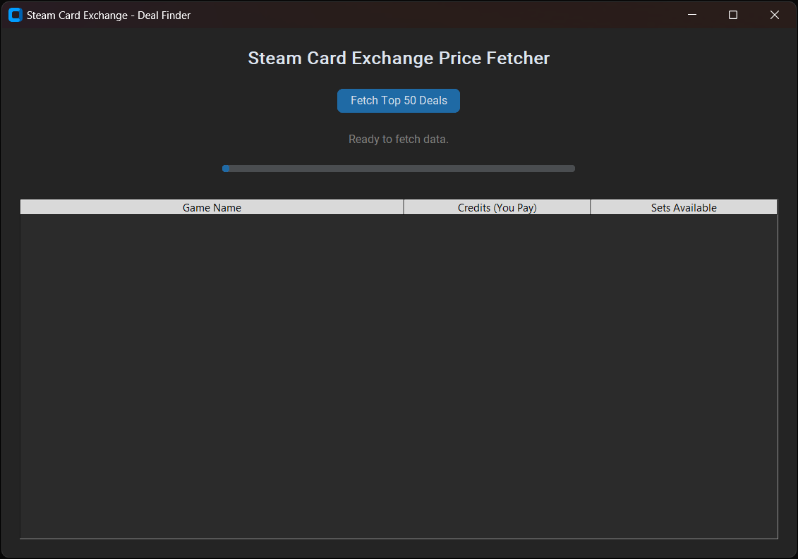

# 🃏 steamcardexchange-deal-finder

A desktop app that scans [Steam Card Exchange](https://www.steamcardexchange.net) and finds the **cheapest trading card sets** available — sorted by total credit cost, with one click to open any listing in your browser.


---

## What It Does

- Fetches the full Steam Card Exchange inventory via their API
- Filters for games where a **complete set** is available to buy
- Checks the actual price of each card using multi-threaded requests
- Displays the **Top 50 cheapest sets** in a clean dark-mode GUI
- Double-click any row to open the listing directly in your browser

---

## Screenshot



---
## ⬇️ Download

> **No Python required!** Just download the EXE and run it.

[](https://github.com/Zeyrox77/steamcardexchange-deal-finder/releases/latest)

## Installation

### Option A – Direct download (recommended)
Download the latest `.exe` from [Releases](https://github.com/Zeyrox77/steamcardexchange-deal-finder/releases).

### Option B – Run from source
**1. Clone the repo**
```bash
git clone https://github.com/Zeyrox77/steamcardexchange-deal-finder.git
cd steamcardexchange-deal-finder
```

**2. Install dependencies**
```bash
pip install -r requirements.txt
```

> Requires Python 3.8 or higher.

---

## Usage

```bash
python steam_card_deal_finder.py
```

1. Click **"Fetch Top 50 Deals"**
2. Wait for the scan to complete (progress bar shows status)
3. Browse the results — sorted cheapest first
4. **Double-click** any row to open the listing on Steam Card Exchange

---

## Dependencies

| Package | Purpose |
|---|---|
| `requests` | HTTP requests to the API and game pages |
| `beautifulsoup4` | Parsing HTML to extract card prices |
| `customtkinter` | Modern dark-mode GUI |

Install all at once:
```bash
pip install -r requirements.txt
```

---

## How It Works

1. **API call** → fetches the full inventory list from `steamcardexchange.net`
2. **Filter** → keeps only games where all cards in the set are available
3. **Multi-threaded scrape** → checks up to 20 pages in parallel to get real prices
4. **Sort & display** → ranks results by total credit cost (lowest first)

---

## Disclaimer

This tool is for personal use only. It accesses publicly available data from Steam Card Exchange.  
Please be respectful of their servers — avoid modifying the thread count to very high values.  
Always check the [Steam Card Exchange Terms of Service](https://www.steamcardexchange.net) before use.

---

## License

MIT — free to use, modify, and share.
